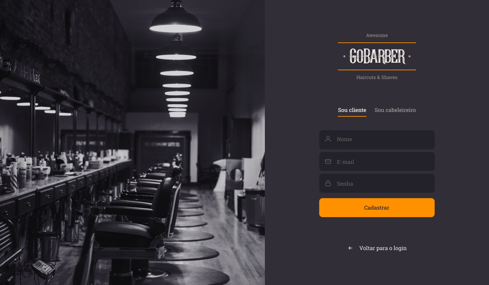
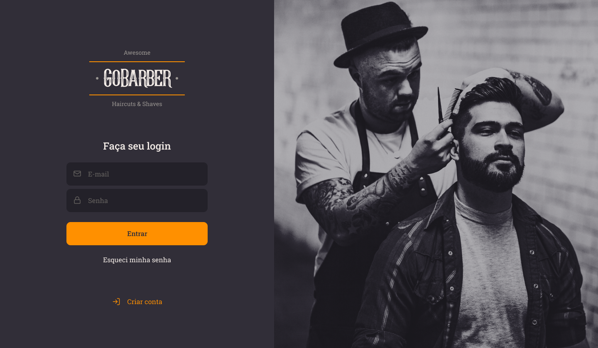
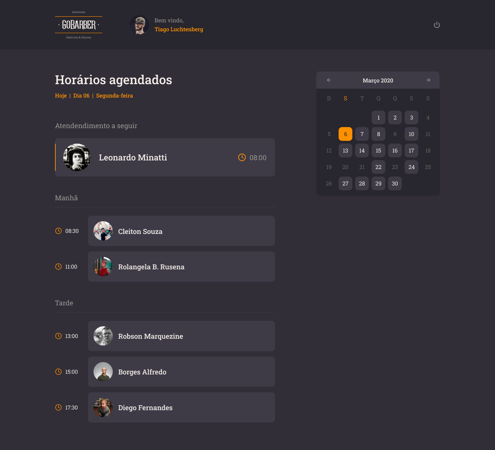
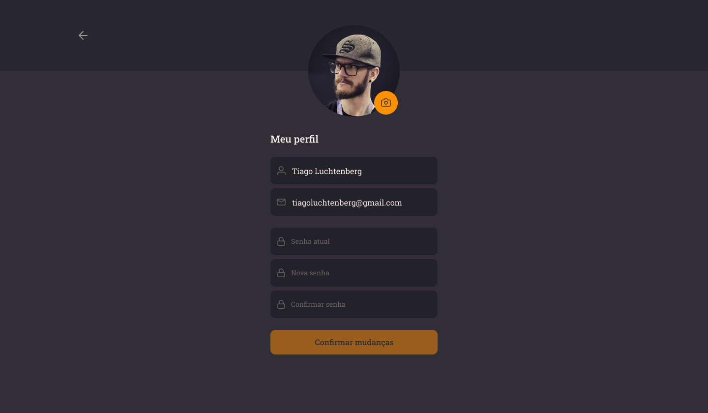

<h1 align="center">
    
    <br>
    GoBarber Mobile
</h1>

---

# Indice

- :rocket: [Sobre o Projeto](#rocket-sobre-o-projeto)
- 👨‍💻️ [Tecnogias utilizadas](#%EF%B8%8F-tecnogias-utilizadas)
- 📦️ [Como utilizar o projeto](#%EF%B8%8F-como-utilizar-o-projeto)
- 🤔️ [Como contribuir](#%EF%B8%8F-como-contribuir)

---

### Imagens do projeto

<div>
  
  
  
  
</div>

## :rocket: Sobre o Projeto

A proposta do **Bootcamp GoStack** da [Rocketseat](https://rocketseat.com.br/) é desenvolver uma aplicação completa para barbearias e salões de beleza chamada GoBarber, onde os prestadores de serviço possam informar seus dias e horários disponíveis para o trabalho, enquanto os clientes possam optar pelo profissional que melhor se enquadre em sua escolha de dia e horário.

O **GoBarber Web** é a construção da versão web da aplicação 💈️💇‍♂️️ **GoBarber** 💅️✂️, que será utilizada pelos prestadores de serviço para visualizar os agendamentos e selecionar o horário de atendimento.

Este projeto de Front-end Web será desenvolvido em ReactJS com TypeScript.

---

## 👨‍💻️ Tecnogias utilizadas

O projeto foi desenvolvido utilizando as seguintes tecnologias:

- [ReactJS](https://reactjs.org/)
- [TypeScript](https://www.typescriptlang.org/)

### Dependências

  - [Axios](https://github.com/axios/axios)
  - :clock2: [Date FNS](https://date-fns.org/)
  - :sparkles: [Polished](https://polished.js.org/)
  - [React Day Picker](https://react-day-picker.js.org/)
  - [React Icons](https://react-icons.github.io/react-icons/)
  - [React Router DOM](https://github.com/ReactTraining/react-router#readme)
  - [React Spring](https://www.react-spring.io/)
  - :nail_care: [Styled Components](https://styled-components.com/)
  - [UUIDv4](https://github.com/thenativeweb/uuidv4#readme)
  - [Yup](https://github.com/jquense/yup)

### Padronização de código

  - [ESLint](https://eslint.org/)
  - [Prettier](https://prettier.io/)
  - :mouse: [Editor Config](https://editorconfig.org/)

### IDE

  - [Visual Studio Code](https://code.visualstudio.com/)

---

## 📦️ Como utilizar o projeto

Para copiar o projeto, utilize os comandos:

```bash
  # Clonar o repositório
  ❯ git clone https://github.com/hericke47/GoBarberWeb.git

  # Entrar no diretório
  ❯ cd gobarber-web
```
Para instalar as dependências e iniciar o projeto, você pode utilizar o Yarn ou NPM:

**Utilizando yarn**

```bash
  # Instalar as dependências
  ❯ yarn

  # Iniciar o projeto
  ❯ yarn dev:server
```

**Utilizando npm**

*PS: Caso utilize o NPM, apaque o arquivo `yarn.lock` para ter todas as dependências instaladas da melhor forma.*

```bash
  # Instalar as dependências
  ❯ npm install

  # Iniciar o projeto
  ❯ npm dev:server
```

---

## 🤔️ Como contribuir

1. Faça o `fork` deste repositório
2. Crie uma branch com sua feature:
   - `$ git checkout -b minha_feature`
3. Confirme sua branch:
   - `$ git commit -m "feature: Meu novo recurso"`
4. Envie sua branch:
   - `$ git push origin minha_feature`

---

